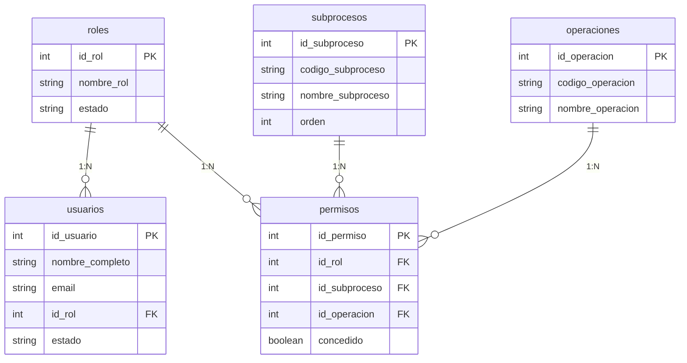
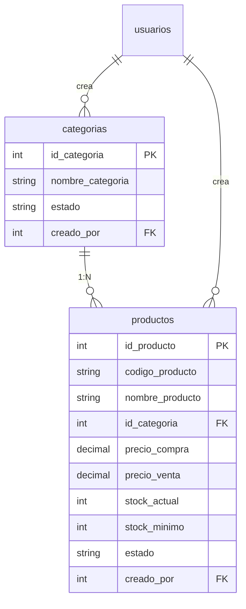
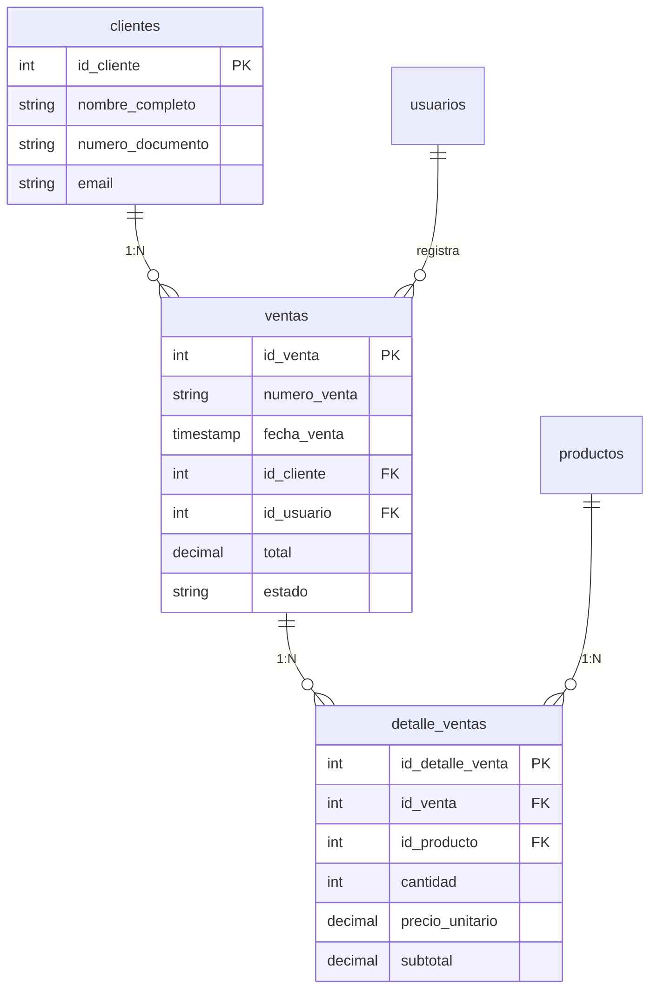
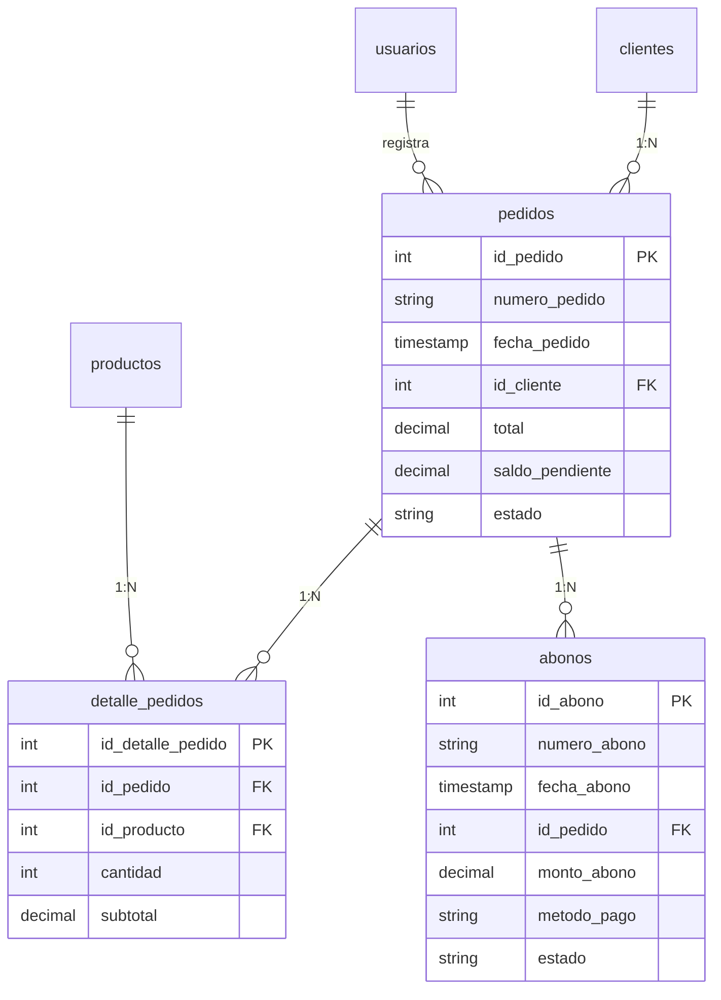
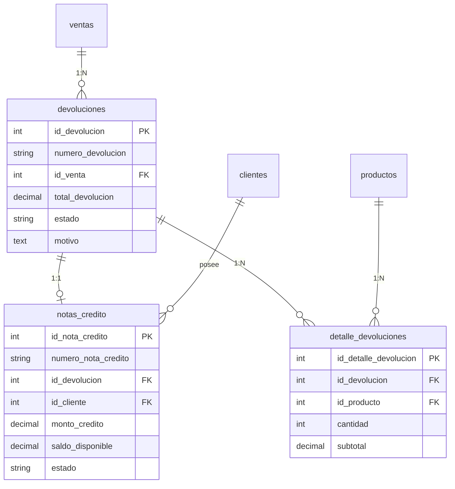

# Diagrama Entidad-Relación del Sistema

## Diagrama ER Completo (Mermaid)

```mermaid
erDiagram
    %% MÓDULO DE AUTENTICACIÓN Y PERMISOS
    roles ||--o{ usuarios : tiene
    roles ||--o{ permisos : tiene
    usuarios ||--o{ permisos : asigna
    subprocesos ||--o{ permisos : tiene
    operaciones ||--o{ permisos : tiene
    
    %% MÓDULO DE CATÁLOGOS
    categorias ||--o{ productos : contiene
    usuarios ||--o{ categorias : crea
    usuarios ||--o{ productos : crea
    usuarios ||--o{ clientes : crea
    usuarios ||--o{ proveedores : crea
    
    %% MÓDULO DE VENTAS
    clientes ||--o{ ventas : realiza
    usuarios ||--o{ ventas : registra
    ventas ||--o{ detalle_ventas : tiene
    productos ||--o{ detalle_ventas : se_vende_en
    
    %% MÓDULO DE COMPRAS
    proveedores ||--o{ compras : provee
    usuarios ||--o{ compras : registra
    compras ||--o{ detalle_compras : tiene
    productos ||--o{ detalle_compras : se_compra_en
    
    %% MÓDULO DE COTIZACIONES
    clientes ||--o{ cotizaciones : solicita
    usuarios ||--o{ cotizaciones : elabora
    cotizaciones ||--o{ detalle_cotizaciones : tiene
    productos ||--o{ detalle_cotizaciones : se_cotiza_en
    
    %% MÓDULO DE PEDIDOS
    clientes ||--o{ pedidos : realiza
    usuarios ||--o{ pedidos : registra
    pedidos ||--o{ detalle_pedidos : tiene
    productos ||--o{ detalle_pedidos : se_pide_en
    
    %% MÓDULO DE ABONOS
    pedidos ||--o{ abonos : recibe
    usuarios ||--o{ abonos : registra
    usuarios ||--o{ abonos : anula
    
    %% MÓDULO DE DEVOLUCIONES
    ventas ||--o{ devoluciones : genera
    usuarios ||--o{ devoluciones : procesa
    devoluciones ||--o{ detalle_devoluciones : tiene
    productos ||--o{ detalle_devoluciones : se_devuelve_en
    
    %% MÓDULO DE NOTAS DE CRÉDITO
    devoluciones ||--o| notas_credito : genera
    clientes ||--o{ notas_credito : posee
    usuarios ||--o{ notas_credito : emite
    
    %% MÓDULO DE AUDITORÍA
    usuarios ||--o{ auditoria_login : intenta_acceso
    usuarios ||--o{ auditoria_operaciones : realiza_operacion
    
    %% DEFINICIÓN DE ENTIDADES
    
    roles {
        int id_rol PK
        string nombre_rol UK
        text descripcion
        string estado
        timestamp fecha_creacion
        timestamp fecha_actualizacion
    }
    
    usuarios {
        int id_usuario PK
        string nombre_completo
        string tipo_documento
        string numero_documento UK
        string email UK
        string telefono
        text direccion
        string password_hash
        int id_rol FK
        string estado
        timestamp fecha_creacion
        timestamp fecha_actualizacion
        timestamp ultimo_acceso
    }
    
    subprocesos {
        int id_subproceso PK
        string nombre_subproceso UK
        string codigo_subproceso UK
        text descripcion
        string icono
        int orden
        string estado
        timestamp fecha_creacion
    }
    
    operaciones {
        int id_operacion PK
        string nombre_operacion
        string codigo_operacion UK
        text descripcion
        string estado
        timestamp fecha_creacion
    }
    
    permisos {
        int id_permiso PK
        int id_rol FK
        int id_subproceso FK
        int id_operacion FK
        boolean concedido
        timestamp fecha_asignacion
        int asignado_por FK
    }
    
    categorias {
        int id_categoria PK
        string nombre_categoria UK
        text descripcion
        string estado
        timestamp fecha_creacion
        timestamp fecha_actualizacion
        int creado_por FK
    }
    
    productos {
        int id_producto PK
        string codigo_producto UK
        string nombre_producto
        text descripcion
        int id_categoria FK
        decimal precio_compra
        decimal precio_venta
        int stock_actual
        int stock_minimo
        text imagen_url
        string estado
        timestamp fecha_creacion
        timestamp fecha_actualizacion
        int creado_por FK
    }
    
    clientes {
        int id_cliente PK
        string nombre_completo
        string tipo_documento
        string numero_documento UK
        string email
        string telefono
        text direccion
        string ciudad
        string estado
        timestamp fecha_creacion
        timestamp fecha_actualizacion
        int creado_por FK
    }
    
    proveedores {
        int id_proveedor PK
        string nombre_empresa
        string nit UK
        string nombre_contacto
        string email
        string telefono
        text direccion
        string ciudad
        string estado
        timestamp fecha_creacion
        timestamp fecha_actualizacion
        int creado_por FK
    }
    
    ventas {
        int id_venta PK
        string numero_venta UK
        timestamp fecha_venta
        int id_cliente FK
        int id_usuario FK
        decimal subtotal
        decimal descuento
        decimal impuesto
        decimal total
        string estado
        string metodo_pago
        text observaciones
        timestamp fecha_creacion
        timestamp fecha_actualizacion
    }
    
    detalle_ventas {
        int id_detalle_venta PK
        int id_venta FK
        int id_producto FK
        int cantidad
        decimal precio_unitario
        decimal descuento
        decimal subtotal
        timestamp fecha_creacion
    }
    
    compras {
        int id_compra PK
        string numero_compra UK
        timestamp fecha_compra
        int id_proveedor FK
        int id_usuario FK
        decimal subtotal
        decimal impuesto
        decimal total
        string estado
        text observaciones
        timestamp fecha_creacion
        timestamp fecha_actualizacion
    }
    
    detalle_compras {
        int id_detalle_compra PK
        int id_compra FK
        int id_producto FK
        int cantidad
        decimal precio_unitario
        decimal subtotal
        timestamp fecha_creacion
    }
    
    cotizaciones {
        int id_cotizacion PK
        string numero_cotizacion UK
        timestamp fecha_cotizacion
        int id_cliente FK
        int id_usuario FK
        decimal subtotal
        decimal descuento
        decimal impuesto
        decimal total
        string estado
        int validez_dias
        text observaciones
        timestamp fecha_creacion
        timestamp fecha_actualizacion
    }
    
    detalle_cotizaciones {
        int id_detalle_cotizacion PK
        int id_cotizacion FK
        int id_producto FK
        int cantidad
        decimal precio_unitario
        decimal descuento
        decimal subtotal
        timestamp fecha_creacion
    }
    
    pedidos {
        int id_pedido PK
        string numero_pedido UK
        timestamp fecha_pedido
        int id_cliente FK
        int id_usuario FK
        decimal subtotal
        decimal descuento
        decimal impuesto
        decimal total
        decimal saldo_pendiente
        string estado
        date fecha_entrega
        text observaciones
        timestamp fecha_creacion
        timestamp fecha_actualizacion
    }
    
    detalle_pedidos {
        int id_detalle_pedido PK
        int id_pedido FK
        int id_producto FK
        int cantidad
        decimal precio_unitario
        decimal descuento
        decimal subtotal
        timestamp fecha_creacion
    }
    
    abonos {
        int id_abono PK
        string numero_abono UK
        timestamp fecha_abono
        int id_pedido FK
        int id_usuario FK
        decimal monto_abono
        string metodo_pago
        string estado
        text observaciones
        timestamp fecha_creacion
        timestamp fecha_actualizacion
        int anulado_por FK
        timestamp fecha_anulacion
        text motivo_anulacion
    }
    
    devoluciones {
        int id_devolucion PK
        string numero_devolucion UK
        timestamp fecha_devolucion
        int id_venta FK
        int id_usuario FK
        decimal total_devolucion
        string estado
        text motivo
        text observaciones
        timestamp fecha_creacion
        timestamp fecha_actualizacion
    }
    
    detalle_devoluciones {
        int id_detalle_devolucion PK
        int id_devolucion FK
        int id_producto FK
        int cantidad
        decimal precio_unitario
        decimal subtotal
        timestamp fecha_creacion
    }
    
    notas_credito {
        int id_nota_credito PK
        string numero_nota_credito UK
        timestamp fecha_nota_credito
        int id_devolucion FK
        int id_cliente FK
        int id_usuario FK
        decimal monto_credito
        decimal saldo_disponible
        string estado
        text observaciones
        timestamp fecha_creacion
        timestamp fecha_actualizacion
    }
    
    auditoria_login {
        int id_auditoria_login PK
        int id_usuario FK
        string email_intento
        boolean exitoso
        string direccion_ip
        text user_agent
        timestamp fecha_intento
    }
    
    auditoria_operaciones {
        int id_auditoria PK
        int id_usuario FK
        string tabla_afectada
        int id_registro
        string operacion
        jsonb datos_anteriores
        jsonb datos_nuevos
        string direccion_ip
        timestamp fecha_operacion
    }
```



## Diagrama Simplificado por Módulos

### 1. Módulo de Autenticación y Permisos



### 2. Módulo de Productos y Catálogos



### 3. Módulo de Ventas



### 4. Módulo de Pedidos y Abonos



### 5. Módulo de Devoluciones y Notas de Crédito



## Matriz de Permisos (roles × subprocesos × operaciones)

```
┌─────────────────┬───────────────┬───────┬──────┬────────┬────────┬────────┬───────┬─────────┐
│     ROL         │  SUBPROCESO   │CREATE │ READ │ UPDATE │ DELETE │ EXPORT │ ANNUL │ APPROVE │
├─────────────────┼───────────────┼───────┼──────┼────────┼────────┼────────┼───────┼─────────┤
│ Administrador   │ TODOS         │   ✓   │  ✓   │   ✓    │   ✓    │   ✓    │   ✓   │    ✓    │
├─────────────────┼───────────────┼───────┼──────┼────────┼────────┼────────┼───────┼─────────┤
│ Empleado        │ USUARIOS      │   ✗   │  ✓   │   ✗    │   ✗    │   ✗    │   ✗   │    ✗    │
│                 │ ROLES         │   ✗   │  ✓   │   ✗    │   ✗    │   ✗    │   ✗   │    ✗    │
│                 │ PRODUCTOS     │   ✓   │  ✓   │   ✓    │   ✗    │   ✓    │   ✗   │    ✗    │
│                 │ CATEGORIAS    │   ✓   │  ✓   │   ✓    │   ✗    │   ✓    │   ✗   │    ✗    │
│                 │ CLIENTES      │   ✓   │  ✓   │   ✓    │   ✗    │   ✓    │   ✗   │    ✗    │
│                 │ PROVEEDORES   │   ✓   │  ✓   │   ✓    │   ✗    │   ✓    │   ✗   │    ✗    │
│                 │ VENTAS        │   ✓   │  ✓   │   ✓    │   ✗    │   ✓    │   ✓   │    ✗    │
│                 │ COMPRAS       │   ✓   │  ✓   │   ✓    │   ✗    │   ✓    │   ✓   │    ✗    │
│                 │ COTIZACIONES  │   ✓   │  ✓   │   ✓    │   ✗    │   ✓    │   ✓   │    ✗    │
│                 │ PEDIDOS       │   ✓   │  ✓   │   ✓    │   ✗    │   ✓    │   ✓   │    ✗    │
│                 │ ABONOS        │   ✓   │  ✓   │   ✓    │   ✗    │   ✓    │   ✓   │    ✗    │
│                 │ DEVOLUCIONES  │   ✓   │  ✓   │   ✓    │   ✗    │   ✓    │   ✓   │    ✗    │
│                 │ NOTAS_CREDITO │   ✓   │  ✓   │   ✓    │   ✗    │   ✓    │   ✓   │    ✗    │
│                 │ DASHBOARD     │   ✗   │  ✓   │   ✗    │   ✗    │   ✓    │   ✗   │    ✗    │
├─────────────────┼───────────────┼───────┼──────┼────────┼────────┼────────┼───────┼─────────┤
│ Cliente         │ PRODUCTOS     │   ✗   │  ✓   │   ✗    │   ✗    │   ✗    │   ✗   │    ✗    │
│                 │ CATEGORIAS    │   ✗   │  ✓   │   ✗    │   ✗    │   ✗    │   ✗   │    ✗    │
└─────────────────┴───────────────┴───────┴──────┴────────┴────────┴────────┴───────┴─────────┘
```

## Estados por Módulo

### Estados Simplificados (2 estados)

```
┌──────────────────┬────────────────────────┐
│     MÓDULO       │       ESTADOS          │
├──────────────────┼────────────────────────┤
│ Cotizaciones     │ Aprobada / Anulada     │
│ Abonos           │ Registrado / Anulado   │
└──────────────────┴────────────────────────┘
```

### Estados Estándar (2-3 estados)

```
┌──────────────────┬──────────────────────────────────┐
│     MÓDULO       │           ESTADOS                │
├──────────────────┼──────────────────────────────────┤
│ Ventas           │ Completada / Anulada             │
│ Compras          │ Completada / Anulada             │
│ Devoluciones     │ Procesada / Anulada              │
│ Pedidos          │ Pendiente / Completado / Anulado │
│ Notas Crédito    │ Disponible / Utilizada / Anulada │
│ Usuarios/Roles   │ Activo / Inactivo                │
│ Productos        │ Activo / Inactivo                │
│ Categorías       │ Activo / Inactivo                │
│ Clientes         │ Activo / Inactivo                │
│ Proveedores      │ Activo / Inactivo                │
└──────────────────┴──────────────────────────────────┘
```

## Flujos de Negocio Principales

### Flujo 1: Proceso de Venta

```
Cliente → Cotización (Aprobada/Anulada) → Pedido (Pendiente) → Abonos (Registrado) 
   → Pedido (Completado) → Venta (Completada) → [Posible Devolución] → Nota de Crédito
```

### Flujo 2: Proceso de Inventario

```
Proveedor → Compra → Detalle Compras → [Trigger: Stock +] → Producto (Stock actualizado)
Cliente → Venta → Detalle Ventas → [Trigger: Stock -] → Producto (Stock actualizado)
```

### Flujo 3: Proceso de Devolución

```
Venta (Completada) → Devolución (Procesada) → Detalle Devolución → [Trigger: Stock +]
   → Nota de Crédito (Disponible) → Cliente puede usar en futuras compras
```

### Flujo 4: Proceso de Permisos

```
Rol → Permisos (Rol × Subproceso × Operación) → Usuario asignado a Rol
   → Usuario hereda permisos del Rol → Usuario accede según permisos
```

## Cardinalidades Importantes

```
roles (1) ←→ (N) usuarios
roles (1) ←→ (N) permisos
subprocesos (1) ←→ (N) permisos
operaciones (1) ←→ (N) permisos

categorias (1) ←→ (N) productos

clientes (1) ←→ (N) ventas
clientes (1) ←→ (N) cotizaciones
clientes (1) ←→ (N) pedidos
clientes (1) ←→ (N) notas_credito

proveedores (1) ←→ (N) compras

ventas (1) ←→ (N) detalle_ventas
ventas (1) ←→ (N) devoluciones

pedidos (1) ←→ (N) detalle_pedidos
pedidos (1) ←→ (N) abonos

devoluciones (1) ←→ (1) notas_credito
devoluciones (1) ←→ (N) detalle_devoluciones
```

---

**Nota:** Este diagrama ER representa la estructura completa del sistema de gestión empresarial con los 14 subprocesos definidos y el sistema de permisos granular implementado.
